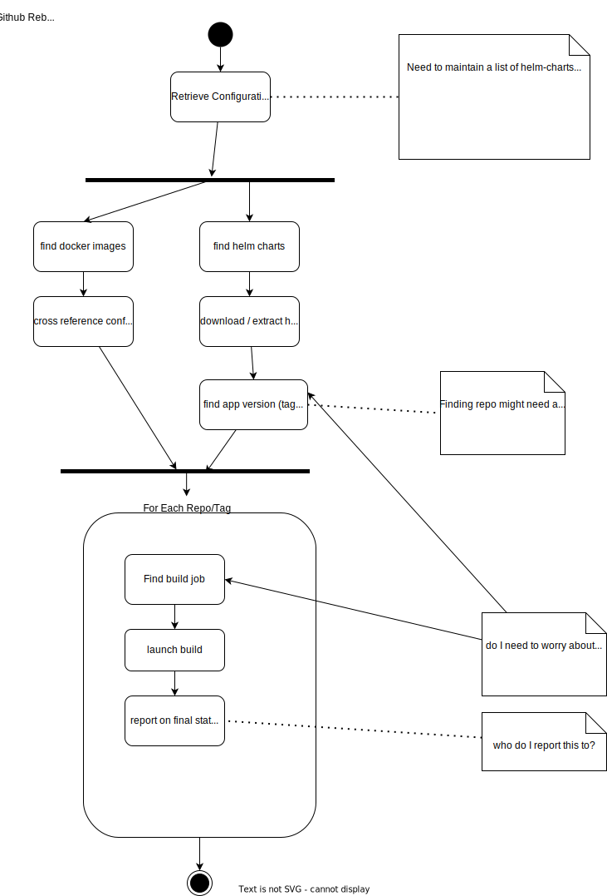

# hms-build-workflow-dispatcher

The purpose of this tool is to provide a means for the HMS docker images to be rebuilt on-demand or on a schedule.

It is beneficial to rebuild docker images periodically to ensure that any upstream CVE fixes are pulled into the image.

## What is the `hms-build-workflow-dispatcher`?

The workflow dispatcher is an infrastructure as code solution to dispatching github workflows.  This bespoke tool is only relevant to the HMS repositories, although the general approach could be used elsewhere. This solution is made up of a few main components:

1. `dispatcher.py` - python application for:
   1. Identifying docker images in the github.com/cray-hpe/csm repo that belong to HMS that need rebuilt. 
   2. Identifying docker images referenced in HMS charts in the github.com/cray-hpe/csm repo that need rebuilt.
   3. identifying the github workflows that would trigger docker image rebuilds.
   4. dispatching workflows, monitoring progress, reporting final status
2. `configuration.yaml` - a YAML configuration file that includes:
   1. `repo-image-lookup` - a lookup between repo and docker image
   2. `docker-image-compare` - a partial tree representation of the `docker/index.yaml` file in the CSM repo. Used for matching HMS images and capturing tags.
   3. `helm-repo-lookup` - a helm chart to artifactory lookup to identify where in artifactory a chart lives.
   4. `configuration` - default configuration for the application.
3. `dispatcher.ipynb` - python jupyter notebook that contains all the same logic as `dispatcher.py`. It was created to ease development, and could be used locally to dispatch docker image build workflows.
4. `hms-build-workflow-dispatcher` docker image
   1. dockerizes the `dispatcher.py` logic
   2. contains the default `configuration.yaml` configuration
5. `dispatch_workflows.yaml` github workflow:
   1. passes the `AUTOMATIC_WORKFLOW_DISPATCHER_APP_KEY` and `AUTOMATIC_WORKFLOW_DISPATCHER_APP_ID` secrets to the docker image.  The secrets are used to retrieve a GITHUB_TOEKN for the `Automatic Workflow Dispatcher` gihub app.
   2. invokes the `hms-build-workflow-dispatcher` docker image and 

## Invocation

### `hms-build-workflow-dispatcher` Workflow

The workflow is configured to execute:

```yaml
on:
  workflow_dispatch:
  pull_request:
  schedule:
    - cron: '0 7 * * *' #7am every day
```

### `dispatcher.py`

Can be invoked by: `./dispatcher.py` - will require you to setup a VENV or have dependencies in `requirements.txt` installed.

Requires a [GITHUB_TOKEN](https://docs.github.com/en/authentication/keeping-your-account-and-data-secure/creating-a-personal-access-token)

### `dispatcher.ipynb` - jupyter notebook

Can be loaded (along with configuration.yaml) into a jupyter environment and executed.  

Requires a [GITHUB_TOKEN](https://docs.github.com/en/authentication/keeping-your-account-and-data-secure/creating-a-personal-access-token)

### `hms-build-workflow-dispatcher` - locally built docker image

```bash
export GITHUB_TOKEN=ghp.....
make; docker run --rm -it -e GITHUB_TOKEN hms-build-workflow-dispatcher:$(cat .version)
```

Perform a dry run:
```bash
export GITHUB_TOKEN=ghp.....
make; docker run --rm -it -e GITHUB_TOKEN -e DRYRUN=true hms-build-workflow-dispatcher:$(cat .version)
```

Requires a [GITHUB_TOKEN](https://docs.github.com/en/authentication/keeping-your-account-and-data-secure/creating-a-personal-access-token)

## Program Flow

